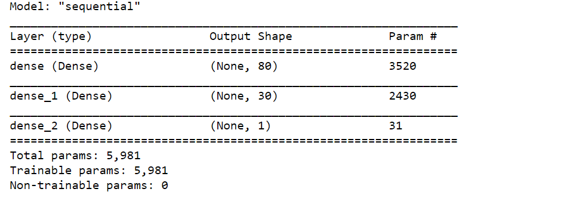
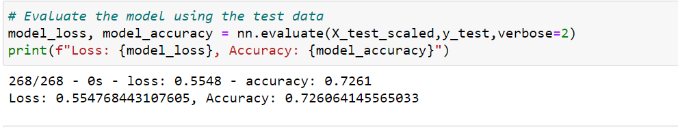
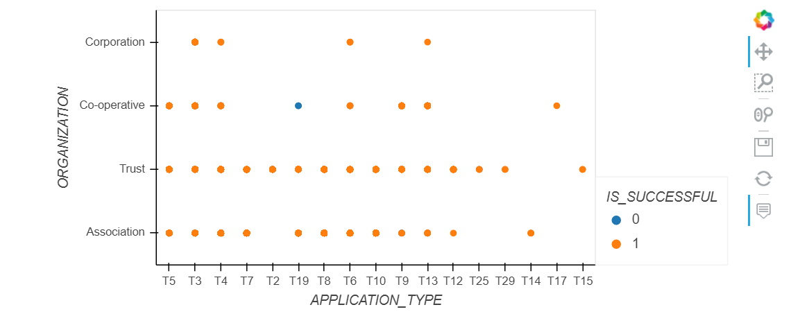

# Neural_Network_Charity_Analysis
## Overview of Analysis
 Alphabet Soup is a non profit organization that donates money to invest in life saving technology and reforestation groups around the world. 
 
 The purpose of this analysis is to determine the impact of each donation to ensure the donated money is being used effectively. The specific question asked is which organizations are worth donating to and which are too high risk. Given the complexity it is decided to use a deep learning neural network to evaluate the data. The result will be used to determine which organizations will receive money and which ones will not.
 
### Tools, Environment and Data
 Environment: Using Python in Jupyter Notebooks
 Tools: Tensor Flow Library, Sklearn, Numpy, seaborn
 Data. The data consists of a csv file containing over 34,000 organizations that have received funding over the year. The specific columns are:
* EIN and NAME—Identification columns
* APPLICATION_TYPE—Alphabet Soup application type
* AFFILIATION—Affiliated sector of industry
* CLASSIFICATION—Government organization classification
* USE_CASE—Use case for funding
* ORGANIZATION—Organization type
* STATUS—Active status
* INCOME_AMT—Income classification
* SPECIAL_CONSIDERATIONS—Special consideration for application
* ASK_AMT—Funding amount requested
* IS_SUCCESSFUL—Was the money used effectively

## Results
### Questions
The first part of this analysis is to answer the following questions:
* The first question is to determine the threshold score that will determine the accuracy of the result. That is determined to be 75%
* The second question is to determine what the target variable(s) is. From the columns listed above this is determined to be  IS_SUCCESSFUL.
* Thirdly, what are the features that will be used to determine the target variable. At first it will be all the remaining columns except for EIN and Name. These two features do not impact the analysis. During analysis some of these features might be removed based on their impact to the model's accuracy.

### The Process and Results
The following steps were conducted:
#### Pre-process the Data
1. Read the data into Jupyter Notebooks and into a DataFrame.
2. Remove EIN and NAME because these two features do not positively impact the analysis.
3. Understand the datatypes and uniqueness of each of the columns.
4. Based on step 3, APPLICATION_TYPE and CLASSIFICATION need to be binned. This is to reduce the number of unique variables to less than 500 for APPLICATION_TYPE and less than 1,800 for classification. Doing this reduces noise and helps with scaling.
5. The string variables are encoded so that they are grouped into numerical categories. This is needed for the model to run.
6. The data is split into the dependent variable y, which again, is IS_SUCCESSFUL and the independent variables/features X. These are all the rest of the columns
7. The y and X variables are then again split into  X_train, X_test, y_train, y_test variables. This is done so that the model can be fitted/trained with training data and then tested/evaluated using the testing data.
8. The last pre-processing step is to scale the data. This is done so that the value range of each of the features are normalized and do not introduce skew into the results.
At the start of this process the data consisted of 34,299 rows and 12 columns. After pre-processing the data set to be used in the model consists of  34,299 rows and 44 columns prior to splitting and scaling.
### Compile Train and Evaluate the Model
#### The Model
Initially, the deep learning neural network uses a sequential model that consists of:
* 1 input layer with the length of the number of features, 44.
* 2 hidden layers with 80 neurons in the first and 30 in the second
* 1 output layer with 1 neuron
Both relu and sigmoid activations were used in different combinations. Results are discussed a little later. The structure is shown here in figure 1.

Figure 1

#### Fit and Evaluation
The model was compiled with the following:
* Loss = binary_crossentropy
* optimizer = adam
* metrics = accuracy
A callback function is then defined and added so that the model weights are saved every 5 epochs.
The model was run using 100 epochs.
The evaluation of that is shown in figure 2.

Figure 2.

The last process step is to save the model to a h5 file.

### Improvement Scenarios
in initial trial and error relu and sigmoid activations were used but the best result was using sigmoid for each of the hidden and output layer

#### Improvement Step One
The inputs were re-evaluated as follows
1. A pair plot was created to view the string features. based on these results shown in figure 3, the feature STATUS, didn't proved any value so it was removed. This improved the accuracy by 0.0006. Not much.
2. Different variables were plotted, removed from the model and evaluated. As one example, see figure 3.
 
Figure 3.

To understand how much ORGANIZATION contributed to the models accuracy, it was removed and the accuracy results were .7234. Due to the decrease, ORGANIZATION was added back in. This process was then repeated with CLASSIFICATION, USE_CASE, SPECIAL_CONSIDERATIONS, INCOME_AMT AND APPLICAITON_TYPE.  No positive changes in accuracy were noted.
3. The next step was to evaluate different combinations of neurons, layers, activation kernels and epochs. Please refer to the following matrix, !(https://github.com/davidmcbee/Neural_Network_Charity_Analysis/blob/main/Resources/Model_matrix.csv). I used a bracketing approach starting with 1 layer and progressing. If the accuracy score improved I followed the changes that caused improvement and when it decreased I went on. Though this does not try every categorical option, it does capture relative trends. Based on this, the best accuracy score obtained is 0.728 but the best accuracy score I could consistently achieve was0.7273 .
4. I also compared this neural network to:
    a. A logistics regression model which scored 0.467.
    b. A Random Forest Classifier which scored 0.709.
    c. a SVM linear model which scored 0.720.
    d. a SVM non-linear model using the rbf kernel which scored 0.726
    
## Results
I understand that adding too many neurons can overfit a model. I also understand that after the loss score stabilizes, adding more epochs doesn't have much effect on the score. Having said that, with the top goal of getting to 75% I tried edge conditions to achieve this but failed. Additionally, consistency in accuracy scores varied run to run. That is I achieved a 0.728 score, per the matrix but after 4 different runs the score was more consistently at 0.7273. Based on the SVM non-linear model score of 0.726 I recommend exploring more non-linear options.
